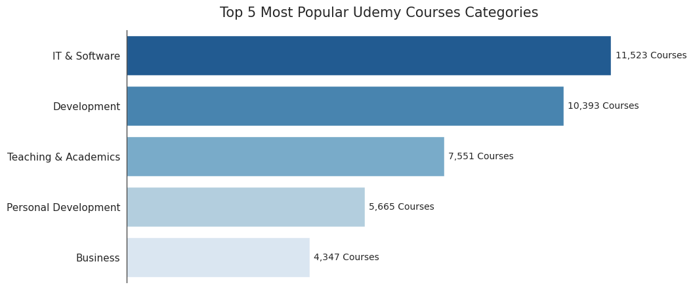
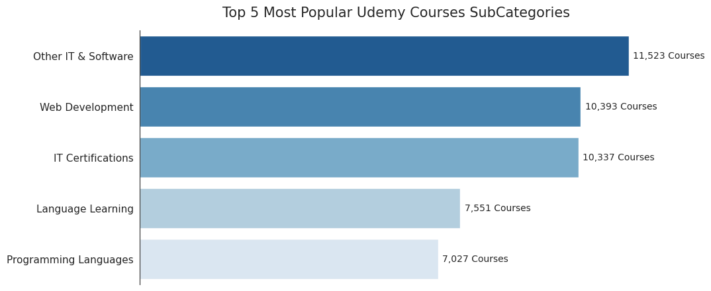
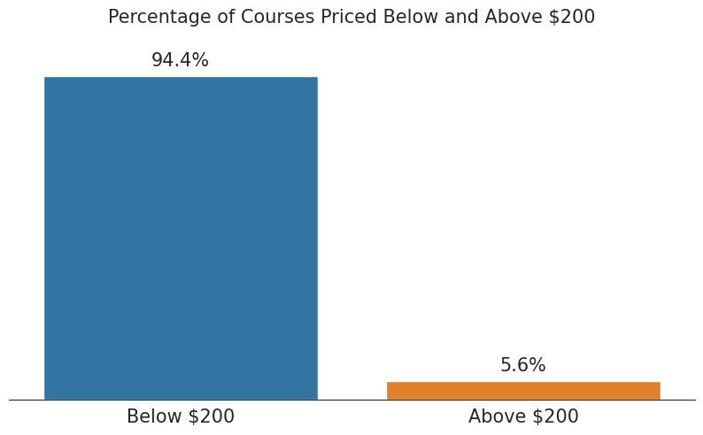
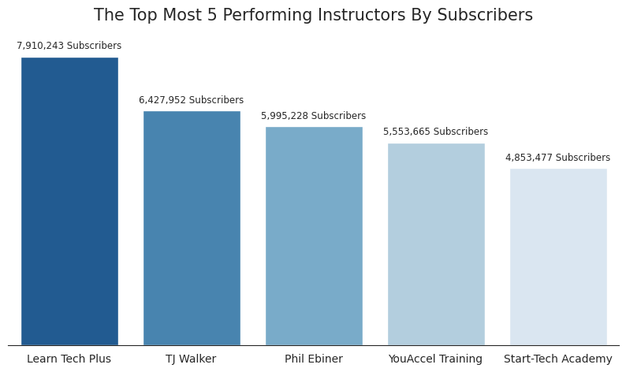
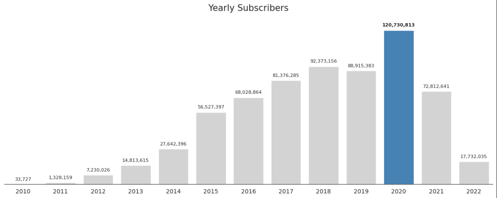

 -OR-

<h1 align="center">💻 Udemy Courses | EDA 📊</h1>

    

---
- [Introduction](#introduction)
- [Data Source](#data-source)
- [Conclusion](#conclusion)
  - [Findings Summary](#findings-summary)
- [Recommendations for Udemy Stockholders](#recommendations-for-udemy-stockholders)

# Introduction

Udemy is a leading online learning platform that offers a vast collection of courses covering a wide range of topics. With its user-friendly interface and accessibility, Udemy has revolutionized the way people learn by providing a platform for both learners and instructors to connect from around the globe. 

Learners can explore a diverse selection of courses, including programming, business, arts, personal development, and more, while instructors can share their knowledge and expertise with a global audience. Whether you're looking to enhance your skills, pursue a new hobby, or advance your career, Udemy.com provides an accessible and flexible learning experience for individuals of all backgrounds and interests.

### In this project, <!-- omit in toc -->

We will be exploring a dataset of of over 209,734 courses and 73,514 instructors teaching courses in 79 languages in 13 different categories.

We will be analyzing this dataset to gain insights into various aspects of courses , including :

- The Popularity of Categories and Subcategories.

- Pricing Analysis.

- Instructor Performance Analysis.

- Time Analysis.

# [Data Source](https://www.kaggle.com/datasets/hossaingh/udemy-courses)

The provided dataset contains a comprehensive collection of information from Udemy courses and user comments. With a total of 209,734 entries and 20 columns, this dataset offers valuable insights into various aspects of online learning. The columns encompass a wide range of data types, including floating-point numbers, boolean values, and textual information.

Key columns include details such as course titles, pricing information, number of subscribers, ratings, reviews, comments, and instructor profiles. Additionally, the dataset provides information about the course content length, publication and update dates, category, subcategory, topic, language, and links to course and instructor pages.

# Conclusion

The analysis of the Udemy Courses Comments dataset highlights key insights. IT & Software, Development, Teaching & Academics, Personal Development, and Business emerged as popular course categories. Subcategories like Other IT & Web Development, IT Certifications, Language Learning, and Programming Languages also gained traction.

The "Java Tutorial for Complete Beginners" course in the Development category had the highest number of subscribers (1,752,367).

Approximately 94.4% of courses are priced below 200 dollars, indicating affordability and accessibility. Top-performing instructors by subscriber count include Learn Tech Plus, TJ Walker, Phil Ebiner, YouAccel Tanning, and Star-Tech Academy.

In terms of experience, Packet Publishing, Bluelime Learning Solutions, lllumeo Learning, Laurence Svekis, and Infinite Skills published the most courses.

The time analysis reveals consistent subscriber growth, peaking in 2020 but declining in early 2021. Notably, 2020 had the highest number of subscribers, with approximately 120,730,813 users.

These findings showcase the popularity of online learning, the diversity of course categories, and the influence of pricing, instructor performance, and temporal trends on user engagement.

These insights provide valuable information for Udemy and its stakeholders, emphasizing the platform's impact in facilitating accessible education and fostering a thriving online learning community.

## Findings Summary

- IT & software, Development, Teaching & Academics, Personal Development and Business are the most popular courses categories on Udemy.

    

    
Click to View Visualization.

    

    

---

- Other IT &, Web Development, IT Certifications, Language Learning and Programming Languages are the most popular courses subcategories on Udemy.

    

    
Click to View Visualization.

    
    

---

- About 94.4% of courses are priced below 200 dollars.

    

    
Click to View Visualization.

    
    

---

- Learn Tech Plus, TJ Walker, Phil Ebiner, YouAccel Tanning and Star-Tech Academy are the topmost 5 performing instructors by subscribers on Udemy.

    

    
Click to View Visualization.

    
    

---

- Year 2020 is the year that Udemy got the most subscribers in, about 120,730,813 users subscribed that year.

    

    
Click to View Visualization.

    
    

# Recommendations for Udemy Stockholders

- Capitalize on the popularity of IT & Software, Development, Teaching & Academics, Personal Development, and Business categories by investing in targeted marketing campaigns to attract more learners to these high-demand courses.

- Collaborate with instructors who have excelled in delivering courses in the most popular subcategories, such as Other IT & Web Development, IT Certifications, Language Learning, and Programming Languages, to create specialized programs and further expand the course offerings in these areas.

- Analyze the pricing structure of courses priced below 200 dollars, which constitute the majority of courses, to ensure optimal revenue generation while maintaining affordability. Consider introducing pricing tiers or bundles to encourage learners to enroll in multiple courses.

- Recognize and incentivize top-performing instructors, such as Learn Tech Plus, TJ Walker, Phil Ebiner, YouAccel Tanning, and Star-Tech Academy, by offering them opportunities to create exclusive content, collaborate on promotional activities, or participate in instructor development programs to further enhance the quality and reputation of the platform.

- Capitalize on the strong growth observed in 2020, the year with the highest number of subscribers, by leveraging the marketing strategies and content trends that contributed to this success. Additionally, closely monitor the decline in early 2021 and investigate potential factors that may have impacted subscriber growth to devise strategies for recovery.
